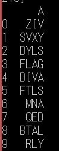
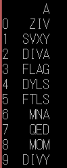
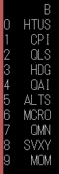
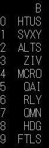

+ 使用指標A做出來的排名:
  + 月排名: 
  + 周排名: 
+ 使用指標B做出來的排名:
  + 月排名: 
  + 周排名: 
  
至於指標C，其中給定t的數列，需要解方程式Ee**(-tk) = 1，
嘗試使用sympy，因為數列太長，答案跑不出來
嘗試使用逼近法，但因為不知道可能的範圍，加上各個ETF的狀況差很多，很難有個統一的逼近方式(有的更是沒有逼近出來)
最後放棄這個項目QQ
