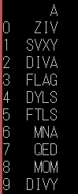
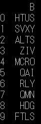

+ 使用指標A做出來的排名:
  + 月排名: 
  + 周排名: 
  + **分析**:  月排名與週排名結果略有不同，但整體而言仍稱相似，可能是因為月資料與週資料的超額報酬率分布差異不甚大。 
  

+ 使用指標B做出來的排名:
  + 月排名: 
  + 周排名: 
  + **分析**:  月排名與週排名結果差異較大，可能是omega指標是以獲利及損失機率之比例為主，短天期資料波動可能較劇烈，故與長天期資料相較，得到的排名差異亦較大。 
  
至於指標C，其中給定t的數列，需要解方程式Ee**(-tk) = 1 
嘗試使用sympy，因為數列太長，答案跑不出來 
嘗試使用逼近法，但因為不知道可能的範圍，加上各個ETF的狀況差很多，很難有個統一的逼近方式(有的更是沒有逼近出來) 
最後放棄這個項目QQ 

**指標分析**: 不同指標算出的結果不盡相同，故於考量績效指標時，仍應先考量投資目的、投資組合規模及風險承受程度等因素，以決定最適合之績效指標。
